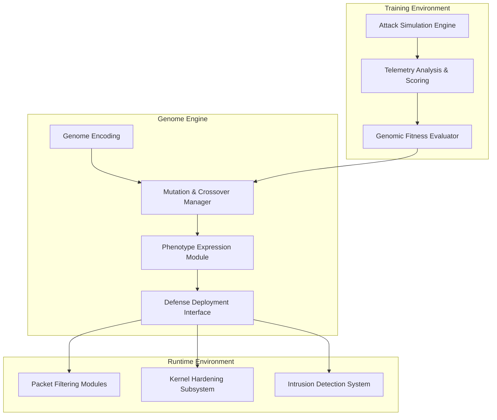

<!-- README.md -->

<!-- ================== BANNER E INTESTAZIONE ================== -->

<div align="center" style="margin-bottom: 20px; font-family: 'Segoe UI', Tahoma, Geneva, Verdana, sans-serif;">

  <h1 style="font-weight: 900; font-size: 3rem; letter-spacing: -0.05em; line-height: 1.1;">
    DeltaDefence
  </h1>

  <p style="font-weight: 400; font-size: 1.25rem; color: #444; margin-top: -0.5rem; font-style: italic;">
    Advanced Genomic Cybersecurity Framework — Adaptive, Modular, AI-Driven
  </p>

  <p style="margin-top: 0.5rem; font-weight: 700; font-size: 0.95rem; letter-spacing: 0.03em;">
    &nbsp;
    &nbsp;
    &nbsp;
    &nbsp;
    
  </p>

  <nav style="margin-top: 1rem; font-size: 1rem; font-weight: 600;">
    <a href="#overview" style="text-decoration:none; color:#0366d6;">Overview</a> &bull;
    <a href="#features" style="text-decoration:none; color:#0366d6;">Features</a> &bull;
    <a href="#architecture" style="text-decoration:none; color:#0366d6;">Architecture</a> &bull;
    <a href="#installation" style="text-decoration:none; color:#0366d6;">Installation</a> &bull;
    <a href="#usage" style="text-decoration:none; color:#0366d6;">Usage</a> &bull;
    <a href="#documentation" style="text-decoration:none; color:#0366d6;">Documentation</a> &bull;
    <a href="#faq" style="text-decoration:none; color:#0366d6;">FAQ</a> &bull;
    <a href="#contributing" style="text-decoration:none; color:#0366d6;">Contributing</a> &bull;
    <a href="#license" style="text-decoration:none; color:#0366d6;">License</a>
  </nav>

</div>

---

## Overview

DeltaDefence is a cutting-edge, AI-powered cybersecurity framework designed to adapt and evolve through a genomic model of defense strategies. It uses artificial genomes to encode configurations, enabling real-time mutation, recombination, and phenotype expression to defend complex systems dynamically.

Designed for both embedded and enterprise environments, DeltaDefence supports:

- Autonomous evolution of defense mechanisms
- Continuous learning from live network telemetry
- Encrypted and authenticated patch updates via secure channels
- Modular integration of diverse defensive components (firewalls, IDS, kernel hardening)
- Offline and resource-constrained operation modes

---

## Features

| Feature                     | Description                                                                                     |
|-----------------------------|-------------------------------------------------------------------------------------------------|
| Genomic Encoding            | Defense strategies encoded as artificial genomes allowing flexible mutation and recombination  |
| Adaptive Defense Engine     | Dynamic runtime adaptation based on environmental telemetry and evolutionary algorithms         |
| Continuous Learning         | Configurable live-learning mode for on-the-fly optimization                                    |
| Secure Patch Pipeline       | Encrypted, signed genomic patch updates ensuring integrity and non-repudiation                  |
| Modular Architecture        | Easily extensible with plug-and-play modules for networking, kernel, logging, encryption, etc.  |
| Multi-Platform Support      | Supports Linux (Debian/RPi), WSL2, Docker containers, and embedded environments                 |
| Offline-First Design        | Fully functional without external network dependencies                                          |
| Extensive Telemetry & Logs  | Comprehensive monitoring with tamper-evident logging and real-time analysis                     |

---

## Architecture


## Detailed Architecture

DeltaDefence embodies a modular and layered architecture that bridges biological evolutionary concepts with cybersecurity engineering.

### Genome Encoding

- **Genome**: A serialized representation of defense parameters and configurations.
- Encodes:
  - Firewall rules and policies
  - Kernel hardening flags and parameters
  - IDS/IPS behavioral signatures
  - Logging and alert thresholds
  - Cryptographic configurations (e.g., cipher suites, key lengths)
  - Network interface parameters (e.g., MAC/IP spoofing toggles)
- Designed for efficient mutation and crossover operations.

### Mutation and Crossover Manager

- Implements configurable mutation rates and operators.
- Supports:
  - Bit-flip mutations on binary-encoded genes.
  - Parameter tweaks on numeric genes.
  - Category shifts on enumerated genes.
- Crossover combines two genomes to produce offspring genomes, preserving effective traits.

### Phenotype Expression Module

- Translates genome to concrete system configuration.
- Interfaces directly with:
  - `iptables` for firewall rules
  - `sysctl` and kernel modules for hardening
  - User-space IDS tools (e.g., Suricata) through config generation
  - Encrypted logging mechanisms

### Defense Deployment Interface

- Ensures atomic deployment with rollback on error.
- Monitors runtime health and enforces real-time adjustments.
- Logs all changes with cryptographic proof.

---

## Installation and Environment Preparation

### Hardware Requirements

- Minimum: x86_64 CPU or ARM Cortex-A72 (e.g., Raspberry Pi 4)
- Recommended: CPU with AVX2 and GPU acceleration for training (NVIDIA CUDA capable)
- Memory: 4GB RAM minimum, 8GB+ preferred for training cycles

### Software Requirements

- Operating System: Debian-based Linux preferred (Ubuntu, Raspbian)
- Python 3.12 or higher
- Docker Engine (for containerized deployment)
- Dependencies:
  - PyTorch >= 2.0
  - Gymnasium
  - Scapy
  - cryptography (AES, RSA, HMAC support)
  - iptables/ip6tables command line tools

---

## Usage

### Running the Defense Agent

```bash
python3 delta_defense_agent.py --config config.yaml --mode runtime
